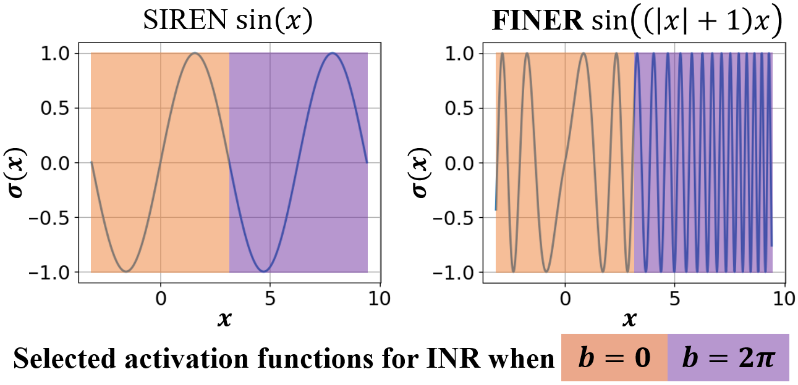

# FINER: Flexible spectral-bias tuning in Implicit NEural Representation by Variable-periodic Activation Functions

## CVPR 2024

[Zhen Liu](https://liuzhen0212.github.io/)<sup>1,\*</sup>,
[Hao Zhu](https://pakfa.github.io/zhuhao_photo.github.io/)<sup>1,\*</sup>,
[Qi Zhang](https://qzhang-cv.github.io/)<sup>2</sup>,
[Jingde Fu](https://fiddiemath.github.io/)<sup>1</sup>,
[Zhan Ma](https://vision.nju.edu.cn/main.htm)<sup>1</sup>,
[Yanwen Guo](https://cs.nju.edu.cn/ywguo/index.htm)<sup>1</sup>,
[Xun Cao](https://cite.nju.edu.cn/People/Faculty/20190621/i5054.html)<sup>1</sup>,

<sup>1</sup>Nanjing University, <sup>2</sup>Tencent AI Lab, <sup>\*</sup>Equal contibution

## [Project Page](https://liuzhen0212.github.io/finer/) | [Paper](https://arxiv.org/abs/2312.02434)

We propose a novel implicit neural representation with flexible spectral-bias tuning for representing and optimizing signals. The repo contains the codes for image fitting. For the SDF and NeRF experiments, we utilized the codes of [Bacon](https://github.com/computational-imaging/bacon) and [torch-ngp](https://github.com/ashawkey/torch-ngp), respectively.

<center>

</center>


## Setup
```bash
conda create -n finer python=3.8
conda activate finer
pip install -r requirements.txt
```

## Training

### Image Fitting
```bash
bash run_finer.sh # run_siren.sh; run_pemlp.sh; run_gauss.sh; run_wire.sh
```

## Citation
```BibTeX
@inproceedings{liu2024finer,
    title = {FINER: Flexible spectral-bias tuning in Implicit NEural Representation by Variable-periodic Activation Functions},
    author = {Liu, Zhen and Zhu, Hao and Zhang, Qi and Fu, Jingde and Deng, Weibing and Ma, Zhan and Guo, Yanwen and Cao, Xun},
    booktitle = {Proceedings of the IEEE/CVF Computer Vision and Pattern Recognition Conference (CVPR)},
    year = {2024}
}
```